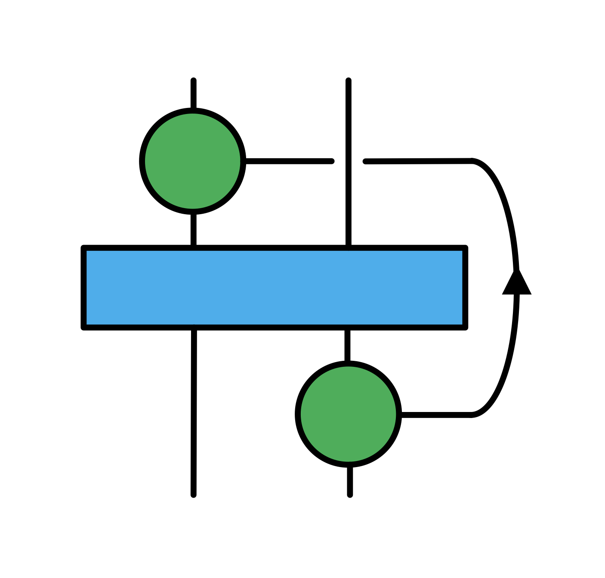

# DCorrelators.jl

*A convenient frontend for calculating dynamical correlation functions and related observables based on matrix-product states time evolution methods.*

## Introduction

- The symbolic operator representation of a quantum lattice system in condensed matter physics is based on the package [`QuantumLattices`](https://github.com/Quantum-Many-Body/QuantumLattices.jl.git)

- The  energy-minimization algorithms like DMRG and the time evolution methods such as MPO $W^{II}$ and TDVP are based on package [`MPSKit`](https://github.com/QuantumKitHub/MPSKit.jl.git)

- The bechmark of dynamical correlation functions and related observables is the result from exact diagonalization method based on the packages [`ExactDiagonalization`](https://github.com/Quantum-Many-Body/ExactDiagonalization.jl.git)


## Installation

Please type `]` in the REPL to use the package mode, then type this command:

```julia
dev "path/to/DCorrelators.jl"
```

## Tutorial
```julia
using TensorKit
using MPSKit
using DCorrelators
using Plots

# give filling = (a,b), where a=b is half-filling, a<b is h-doping and a>b is e-doping
filling = (1,1)

# give a hamiltonian
H = hubbard(Float64, SU2Irrep, U1Irrep; filling=filling, t=1, U=8, μ=0)

# give a N-site random initial state 
N=4
st = randFiniteMPS(ComplexF64, SU2Irrep, U1Irrep, N; filling=filling)

#find the ground state |gs> 
gs, envs, delta = find_groundstate(st, H, DMRG2(trscheme= truncbelow(1e-6)));

#obtain c^†_1|gs> and c^†_4|gs> 
ep =  e_plus(Float64, SU2Irrep, U1Irrep; side=:L, filling=filling)
i, j = 1, 4
cgs₁ = chargedMPS(ep, gs, i)
cgs₂ = chargedMPS(ep, gs, j)

#calculate the propagator: <gs|c_1(t)c^†_4|gs> (i.e. <gs|c_1(0)e^{-iHt}c^†_4|gs>)
dt = 0.05
ft = 10
pros = propagator(H, cgs₁, cgs₂; rev=false, dt=dt, ft=ft)
title = "Im<C_$i(t)C^†_$j(0)> step=$dt, finialtime=$ft"
f = plot(collect(0:dt:ft),-imag.(pros), title=title, legend=false)
savefig(f,"./src/example/$title.png")
```
 step=0.05, finialtime=10.png"  width="600"  align="center" />

## Dynamical correlation functions

### Discrete space and time Fourier transforms

If the $x$ variable has only discrete values ($x=na$, for $n=1,2,3,...,N$) and finite length $L$ ($L=Na$), the expansion of the function is

$$f_n=\sum_{m=1}^{N} A_{q} e^{iq_m x_n},\quad q=\frac{2\pi}{L}m,$$

where 

$$A_{q}=\frac{1}{N}\sum^N_{n=1}f_n e^{-iq_mx_n}. $$

Dividing $A_{q}$ by the mode $\frac{2\pi}{L}$, the Fourier amplitudes with a per unit spacial interval is

$$ A(q) = \frac{L}{2\pi}A_q=\frac{a}{2\pi}\sum^N_{n=1}f_ne^{-iqx_n}.$$

If the times $t$ are discrete times ($t=l\Delta t$, for $l=0,1,2,...,N$) and the final evolutionary time $t_{\mathrm{end}}=N\Delta t$, the expansion of the function is

$$ f_l=\sum_{p=1}^N A_{\omega} e^{-i\omega_p t_l},\quad \omega=\frac{2\pi}{t_{\mathrm{end}}}p,$$

where

$$A_{\omega}=\frac{1}{N}\sum_{l=1}^N f_l e^{i\omega_p t_l}.$$

To make it a per unit frequency interval, one need to divide by the spacing of the discrete frequency mode and the Fourier amlitudes are given by,

$$A(\omega)=\frac{t_{\mathrm{end}}}{2\pi}A_{\omega}=\frac{\Delta t}{2\pi}\sum_{l=1}^N f_l e^{i\omega t_l}.$$

Although a Fourier series is designed to represent functions that are periodic, one can assume that the finite data sequence can be periodically repeated, which leads to the time at index $l=N$ is identified with the time at $l=0$. However, the small errors made at the end of a period will be irrelevant as long as the primary correlations decay in less time than $t_{\mathrm{end}}$. 

### Space and time correlations 

By use of double Fourier transforms, one can obtain the $k-\omega$ space correlation function $G(k,\omega)$,

$$G(k,\omega)=\frac{1}{(2\pi)^2}\Delta t\sum_{l=1}^{N_t} a\sum_{n=1}^{N_L} G(x, t) e^{-i(kx-\omega t)}.$$

With 

$$\Delta t \sum_{l=1}^{N_t}\to \int_0^{t_{\mathrm{end}}}dt,\quad a\sum_{n=1}^{N_L}\to \int_0^L dx,$$

the continuous form is as follows 

$$ G(k,\omega) = \frac{1}{(2\pi)^2} \int_0^{t_{\mathrm{end}}}dt \int_0^L dx G(x, t) e^{-i(kx-\omega t)}. $$

The real-space and real-time correlation function $G(x, t)$ is given by,

$$ \begin{aligned}G\left( x_{n},t\right) &=\frac{1}{N_t}\sum_{l=1}^{N_t}\frac{1}{N_{L}}\sum_{m=1}^{N_{L}}\langle 0 | C\left( x_{m}+x_{n},t_{l}+t\right) C^{\dagger}\left( x_{m},t_{l}\right) | 0\rangle \\
&=\frac{1}{N_t}\sum_{l=1}^{N_t}\frac{1}{N_{L}}\sum_{m=1}^{N_L}\langle 0| e^{iH(t_{l}+t)}C\left( x_{m}+x_{n}\right) e^{-iH(t_l+t) }e^{iHt_{l}}C^{\dagger}\left( x_{m}\right) e^{-iHt_{l}}| 0\rangle \\
&=\frac{1}{N_{L}}\sum_{m=1}^{N_{L}}e^{iE_{0}t}\langle 0| C\left( x_{m}+x_{n}\right) e^{-iHt}C^{\dagger}\left( x_{m}\right) | 0\rangle. \end{aligned}$$

Finally, one gets,

$$ G(k,\omega)=\frac{1}{(2\pi)^2}\Delta t\sum_{l=1}^{N_t} a\sum_{n=1}^{N_L} \frac{1}{N_{L}}\sum_{m=1}^{N_{L}}e^{iE_{0}t}\langle 0| C\left( x_{m}+x_{n}\right) e^{-iHt}C^{\dagger}\left( x_{m}\right) | 0\rangle e^{-i(kx_n-\omega t)}. $$

Here, the matrix-product states time evolution methods are implemented to solve the state $e^{-iHt}C^{\dagger}\left( x_{m}\right) | 0\rangle$.

### References
- Wysin G M. Magnetic Excitations and Geometric Confinement[M]. Philadelphia, USA: IOP, 2015.

- Paeckel S, Köhler T, Swoboda A, et al. Time-evolution methods for matrix-product states[J]. Annals of Physics, 2019, 411: 167998.

## Note

Due to the fast development of this package, releases with different minor version numbers are **not** guaranteed to be compatible with previous ones **before** the release of v1.0.0. Comments are welcomed in the issues.

## Contact

Y.-Y.Zong: zongyy_phy@smail.nju.edu.cn

Jason: wavefuncion@gmail.com

## Acknowledgments

We thank Maartenvd, lkdvos for help discussions in https://github.com/QuantumKitHub/MPSKit.jl/issues/160#issue-2430771115, and thank Zhao-Long Gu for great help.