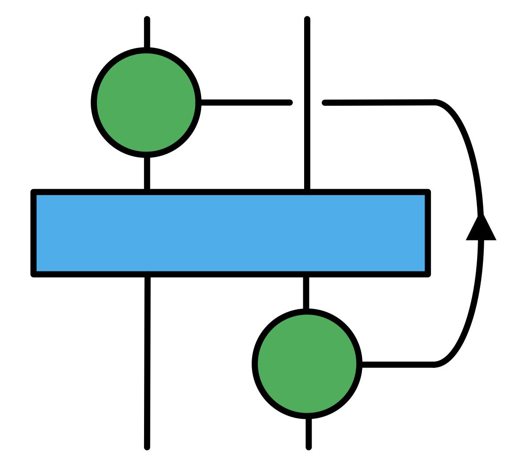

# DynamicalCorrelators.jl

*A convenient frontend for calculating dynamical correlation functions and related observables based on matrix-product states time evolution methods.*

## Introduction

- The symbolic operator representation of a quantum lattice system in condensed matter physics is based on the package [`QuantumLattices`](https://github.com/Quantum-Many-Body/QuantumLattices.jl.git)

- The  energy-minimization algorithms like DMRG and the time evolution methods such as MPO $W^{II}$ and TDVP are based on package [`MPSKit`](https://github.com/QuantumKitHub/MPSKit.jl.git)

- The bechmark of dynamical correlation functions and related observables is the result from exact diagonalization method based on the packages [`ExactDiagonalization`](https://github.com/Quantum-Many-Body/ExactDiagonalization.jl.git)


## Installation

Please type `]` in the REPL to use the package mode, then type this command:

```julia
add DynamicalCorrelators
```

## Tutorial

Constuct a lattice by [`QuantumLattices`](https://github.com/Quantum-Many-Body/QuantumLattices.jl.git):
```julia
using QuantumLattices
#define the unitcell
unitcell = Lattice([0.0, 0.0]; vectors=[[1/2, √3/2], [1, 0]])
#give the length and width of the lattice and give the boundary condition where 'o' is open and 'p' is periodic
lattice = Lattice(unitcell, (2, 2), ('o', 'o'))
f = plot(lattice,1; siteon=true)

```


With the help of [`QuantumLattices`](https://github.com/Quantum-Many-Body/QuantumLattices.jl.git), constructing the lattice of a realistic system allows for the convenient inclusion of terms in the Hamiltonian for arbitrary neighbors, without the need to construct different types of lattices and define their neighbor relations case by case:

```julia
using TensorKit
using MPSKit
using DynamicalCorrelators
using Plots
#define the hilbert space
hilbert = Hilbert(site=>Fock{:f}(1, 2) for site=1:length(lattice))

#give the terms in the Hamiltonian
t = Hopping(:t, -1.0, 1)
U = Hubbard(:U, 8.0)

#construct the Hamiltonian
H = hamiltonian((t, U), lattice, hilbert; neighbors=1)
```

Here, ``hamiltonian`` returns a ``MPOHamiltonian`` type data that can be directly used in the algorithms like DMRG in [`MPSKit`](https://github.com/QuantumKitHub/MPSKit.jl.git):

```julia
#give the filling = (a, b) -> filling = a/b
filling = (1, 1)

#find the ground state and ground energy
st = randFiniteMPS(Float64, U1Irrep, U1Irrep, length(lattice); filling=filling)
gs, envs, delta = find_groundstate(st, H, DMRG2(trscheme= truncbelow(1e-9)));
E0 = expectation_value(gs, H)
```

It should be noted that currently, this construction method is only supported for Hamiltonians with Abelian symmetries. For Hamiltonians with non-Abelian symmetries, the construction still needs to follow the method used in [`MPSKitModels`](https://github.com/QuantumKitHub/MPSKitModels.jl).

Next, let’s look at how to calculate correlation functions. Here, I consider SU(2) symmetry, so I use the pre-defined `MPOHamiltonian` in the `models` file. If only U(1) symmetry is considered, using the method described above to obtain the `MPOHamiltonian` provides greater flexibility.

```julia
using TensorKit
using MPSKit
using DynamicalCorrelators

# give filling = (a,b), where a=b is half-filling, a<b is h-doping and a>b is e-doping
filling = (1,1)

# give a hamiltonian
H = hubbard(Float64, SU2Irrep, U1Irrep; filling=filling, t=1, U=8, μ=0)

# give a N-site random initial state 
N=4
st = randFiniteMPS(ComplexF64, SU2Irrep, U1Irrep, N; filling=filling)

#find the ground state |gs> 
gs, envs, delta = find_groundstate(st, H, DMRG2(trscheme= truncbelow(1e-6)));

#obtain c^†_1|gs> and c^†_4|gs> 
ep =  e_plus(Float64, SU2Irrep, U1Irrep; side=:L, filling=filling)
i, j = 1, 4
cgs₁ = chargedMPS(ep, gs, i)
cgs₂ = chargedMPS(ep, gs, j)

#calculate the propagator: <gs|c_1(t)c^†_4|gs> (i.e. <gs|c_1(0)e^{-iHt}c^†_4|gs>)
dt = 0.05
ft = 10
pros = propagator(H, cgs₁, cgs₂; rev=false, dt=dt, ft=ft)
```


```julia
#calculate ground state energy
E0 = expectation_value(gs, H)

#give the creation and annihilation operators
cp =  e_plus(Float64, SU2Irrep, U1Irrep; side=:L, filling=filling)
cm =  e_min(Float64, SU2Irrep, U1Irrep; side=:L, filling=filling)
sp =  S_plus(Float64, SU2Irrep, U1Irrep; filling=filling)

#calculate the dynamical single-particle correlation function 
edc = dcorrelator(RetardedGF{:f}, H, E0, [[chargedMPS(cp, gs, i) for i in 1:48]; [chargedMPS(cm, gs, i) for i in 1:48]]; trscheme=truncdim(200), n=n, dt=dt, ft=ft)

#calculate the dynamical two-particle spin-spin correlation function 
sdc = dcorrelator(GreaterLessGF, H, E0, [chargedMPS(sp, gs, i) for i in 1:48]; whichs=:greater, trscheme=truncdim(200), n=n, dt=dt, ft=ft)
```
After Fourier transforms, we can obtain their spectral functions:


for the electron spectrum, and


for the spin-spin spectrum.

## Dynamical correlation functions

### Discrete space and time Fourier transforms

If the $x$ variable has only discrete values ($x=na$, for $n=1,2,3,...,N$) and finite length $L$ ($L=Na$), the expansion of the function is

$$f_n=\sum_{m=1}^{N} A_{q} e^{iq_m x_n},\quad q=\frac{2\pi}{L}m,$$

where 

$$A_{q}=\frac{1}{N}\sum^N_{n=1}f_n e^{-iq_mx_n}. $$

Dividing $A_{q}$ by the mode $\frac{2\pi}{L}$, the Fourier amplitudes with a per unit spacial interval is

$$ A(q) = \frac{L}{2\pi}A_q=\frac{a}{2\pi}\sum^N_{n=1}f_ne^{-iqx_n}.$$

If the times $t$ are discrete times ($t=l\Delta t$, for $l=0,1,2,...,N$) and the final evolutionary time $t_{\mathrm{end}}=N\Delta t$, the expansion of the function is

$$ f_l=\sum_{p=1}^N A_{\omega} e^{-i\omega_p t_l},\quad \omega=\frac{2\pi}{t_{\mathrm{end}}}p,$$

where

$$A_{\omega}=\frac{1}{N}\sum_{l=1}^N f_l e^{i\omega_p t_l}.$$

To make it a per unit frequency interval, one need to divide by the spacing of the discrete frequency mode and the Fourier amlitudes are given by,

$$A(\omega)=\frac{t_{\mathrm{end}}}{2\pi}A_{\omega}=\frac{\Delta t}{2\pi}\sum_{l=1}^N f_l e^{i\omega t_l}.$$

Although a Fourier series is designed to represent functions that are periodic, one can assume that the finite data sequence can be periodically repeated, which leads to the time at index $l=N$ is identified with the time at $l=0$. However, the small errors made at the end of a period will be irrelevant as long as the primary correlations decay in less time than $t_{\mathrm{end}}$. 

### Space and time correlations 

By use of double Fourier transforms, one can obtain the $k-\omega$ space correlation function $G(k,\omega)$,

$$G(k,\omega)=\frac{1}{(2\pi)^2}\Delta t\sum_{l=1}^{N_t} a\sum_{n=1}^{N_L} G(x, t) e^{-i(kx-\omega t)}.$$

With 

$$\Delta t \sum_{l=1}^{N_t}\to \int_0^{t_{\mathrm{end}}}dt,\quad a\sum_{n=1}^{N_L}\to \int_0^L dx,$$

the continuous form is as follows 

$$ G(k,\omega) = \frac{1}{(2\pi)^2} \int_0^{t_{\mathrm{end}}}dt \int_0^L dx G(x, t) e^{-i(kx-\omega t)}. $$

The real-space and real-time correlation function $G(x, t)$ is given by,

$$ \begin{aligned}G\left( x_{n},t\right) &=\frac{1}{N_t}\sum_{l=1}^{N_t}\frac{1}{N_{L}}\sum_{m=1}^{N_{L}}\langle 0 | C\left( x_{m}+x_{n},t_{l}+t\right) C^{\dagger}\left( x_{m},t_{l}\right) | 0\rangle \\
&=\frac{1}{N_t}\sum_{l=1}^{N_t}\frac{1}{N_{L}}\sum_{m=1}^{N_L}\langle 0| e^{iH(t_{l}+t)}C\left( x_{m}+x_{n}\right) e^{-iH(t_l+t) }e^{iHt_{l}}C^{\dagger}\left( x_{m}\right) e^{-iHt_{l}}| 0\rangle \\
&=\frac{1}{N_{L}}\sum_{m=1}^{N_{L}}e^{iE_{0}t}\langle 0| C\left( x_{m}+x_{n}\right) e^{-iHt}C^{\dagger}\left( x_{m}\right) | 0\rangle. \end{aligned}$$

Finally, one gets,

$$ G(k,\omega)=\frac{1}{(2\pi)^2}\Delta t\sum_{l=1}^{N_t} a\sum_{n=1}^{N_L} \frac{1}{N_{L}}\sum_{m=1}^{N_{L}}e^{iE_{0}t}\langle 0| C\left( x_{m}+x_{n}\right) e^{-iHt}C^{\dagger}\left( x_{m}\right) | 0\rangle e^{-i(kx_n-\omega t)}. $$

Here, the matrix-product states time evolution methods are implemented to solve the state $e^{-iHt}C^{\dagger}\left( x_{m}\right) | 0\rangle$.

### References
- Wysin G M. Magnetic Excitations and Geometric Confinement[M]. Philadelphia, USA: IOP, 2015.

- Paeckel S, Köhler T, Swoboda A, et al. Time-evolution methods for matrix-product states[J]. Annals of Physics, 2019, 411: 167998.

## Note

Due to the fast development of this package, releases with different minor version numbers are **not** guaranteed to be compatible with previous ones **before** the release of v1.0.0. Comments are welcomed in the issues.

## Contact

Y.-Y.Zong: zongyongyue@gmail.com;
Jason: wavefuncion@gmail.com

## Acknowledgments

We thank Maartenvd, lkdvos for help discussions in https://github.com/QuantumKitHub/MPSKit.jl/issues/160#issue-2430771115, and thank Zhao-Long Gu for great help.